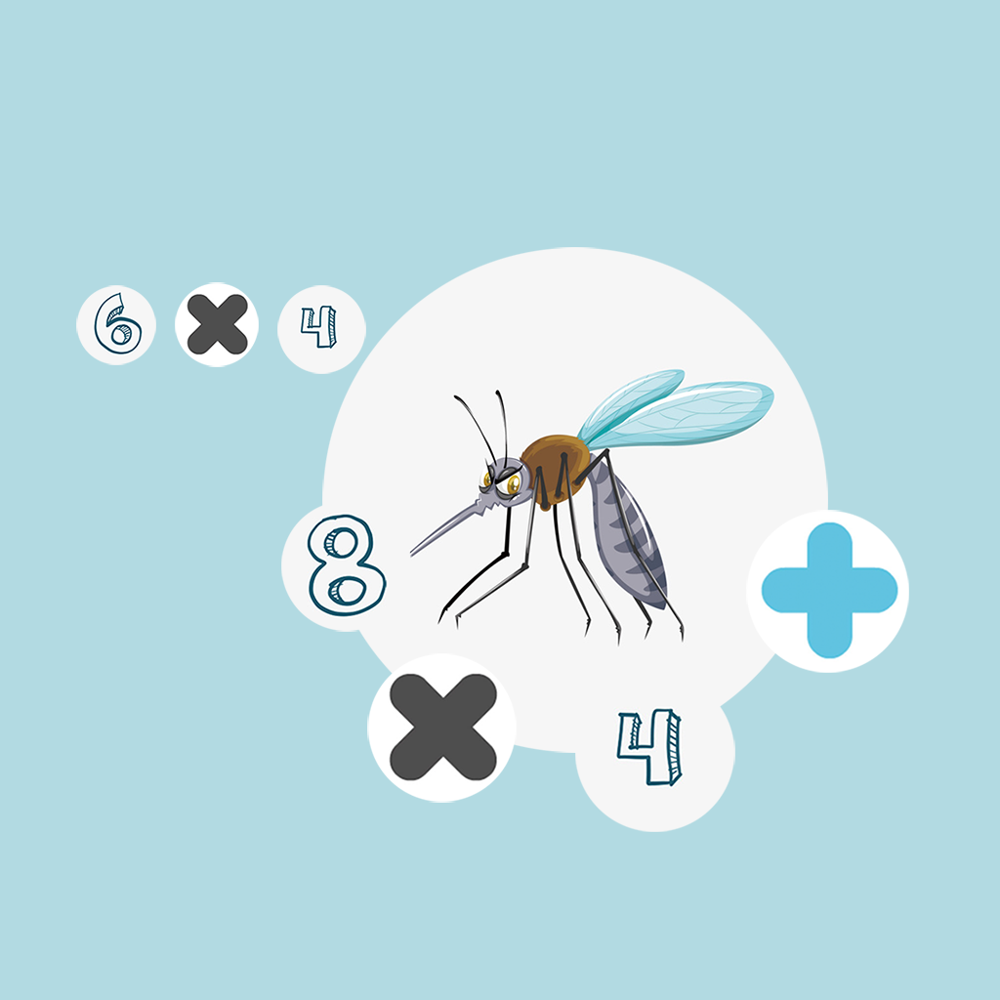

## Welcome to Interesting Equation Number

This is a very interesting equation tool. You need to find the number you need in a moving mosquito within 20 seconds, and find a constantly changing arithmetic type in another mosquito to form an interesting equation, so that the equation can be complete and the correct answer can be calculated within 20 seconds, and then you can successfully enter the next question. In this process, you can practice your fast computing ability and hand speed, and enjoy the fun of arithmetic.

If you have any questions, you can either leave a message or send the questions to our email address.

We will answer them for you in the first time.

### Address: zhanghesongyuan7@126.com

Thank you!
